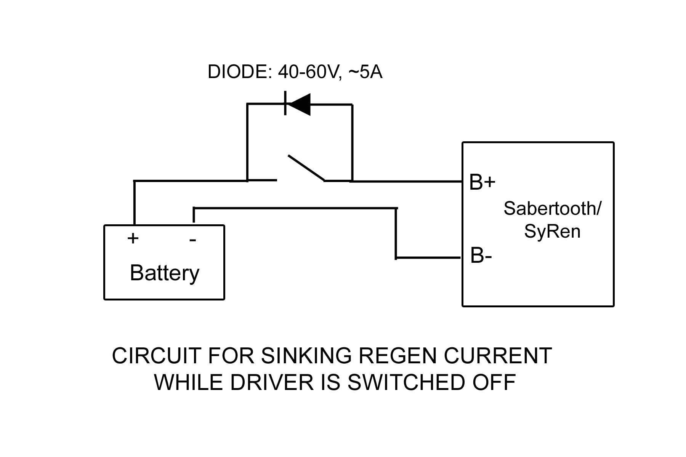

# IAM Wiring

Mainly pointing to resources for now.

- [Robot Electrical Power](http://www.superdroidrobots.com/shop/custom.aspx/robot-electrical-power-and-wiring/53/)
- From [Dimension Engineering](http://www.dimensionengineering.com/)

